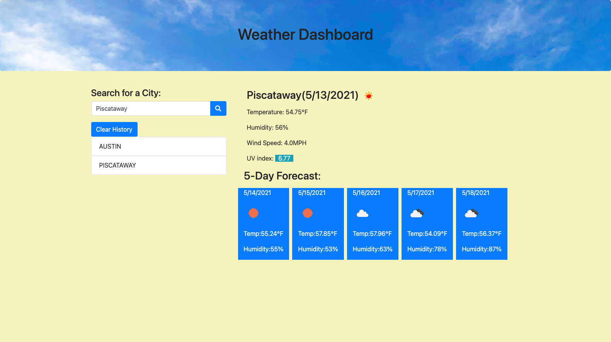

<h1 align="center">Weather Dashboard 🌞</h1>

### 🏠 https://crenauro.github.io/Weather-Dashboard/

 

# Install

Open the above link in your browser.
 
 

# Usage

 
 
When you type in and search for a city, you are presented with current and future conditions for that city. That city is then added to the
search history. When you click on a city in the search history, you are again presented with current and future conditions for that city.

 

# Description

This app uses OpenWeather API to retrieve weather data for cities. The HTML and CSS are dynamically updated. Local Storage is used to store persistant data.

 

# Credits

Huge thanks to my tutor and AskBCS. Background header image is my own.
